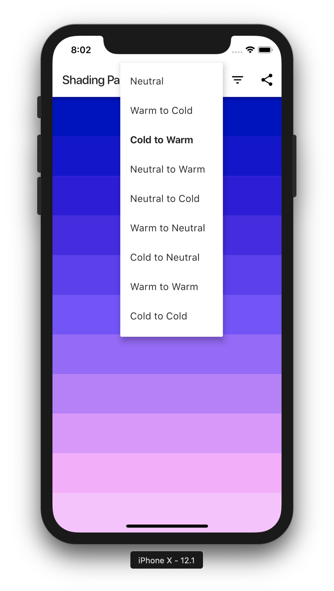

# Shading palette

Shading palette app helps to create "perfect" shades for coloring a sketch.

It can be essential for artist and designers. Colors bring life to 2D sketches if they are selected correctly.
The trick is to use warm shadows and cold highlights if a light source has a cold color (or cold shadows and warm highlights if a light source has a warm color)
for more natural and interesting look of their art projects.

Give it a try! Just select a medium color, choose a mode and the app will generate beautiful shades.

Available modes are:
- Neutral
- Warm to Cold (to generate warm shadows and cold highlights)
- Cold to Warm (cold shadows and warm highlights)
- Neutral to Warm (warm highlights)
- Neutral to Cold (cold highlights)
- Warm to Neutral (warm shadows)
- Cold to Neutral (cold shadows)
- Warm to Warm (warm shadows and highlights)
- Cold to Cold (cold shadows and highlights).

## Shades examples

`Neutral`

`Warm to Cold`

`Cold to Warm`

## UI screenshots

Medium color picker:

Mode dropdown:

Shades count dropdown:

MIT License

Julia Rechkunova <julia.rechkunova@gmail.com>
