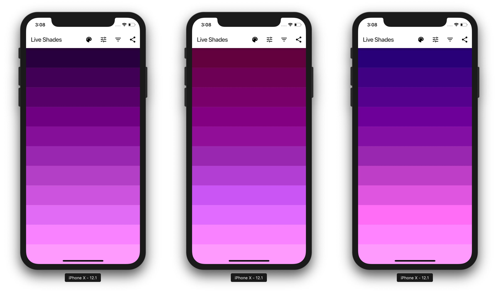

# LiveShades

LiveShades app helps to prepare nice shades for coloring and shading a sketch.

It can be essential for artist and designers, especially beginners, as colors bring life and 3D effect to 2D sketches if they are selected correctly.

The trick is to change hue along with color value for a more natural and interesting look. Depending on a light source hue can get warmer or colder:
- for a "warm" light source it's recommended to have warm highlights and cold shadows,
- for a "cold" light source - cold highlights and warm shadows.

Give it a try! Just select a mid-tone color, choose a mode and the app will generate beautiful shades.

Available modes are:
- Neutral
- Warm to Cold (to generate warm shadows and cold highlights)
- Cold to Warm (cold shadows and warm highlights)
- Neutral to Warm (warm highlights)
- Neutral to Cold (cold highlights)
- Warm to Neutral (warm shadows)
- Cold to Neutral (cold shadows)
- Warm to Warm (warm shadows and highlights)
- Cold to Cold (cold shadows and highlights).

Play with settings in the app to get inspired and to find a shading palette which works best for your art project.

## Shades examples

For the same mid-tone color the app generates these shades in 3 different modes (`Neutral`, `Warm to Cold`, `Cold to Warm`):

## UI screenshots

"Mid-tone color" picker, "Mode" dropdown, "Shades count" dropdown:

MIT License

Julia Rechkunova <julia.rechkunova@gmail.com>
